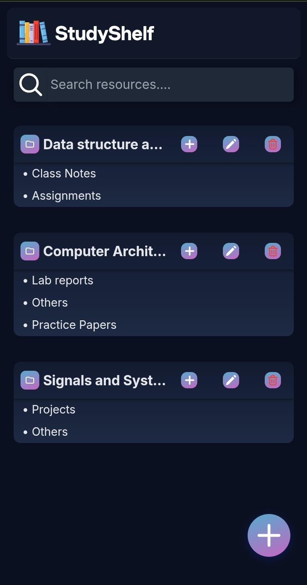
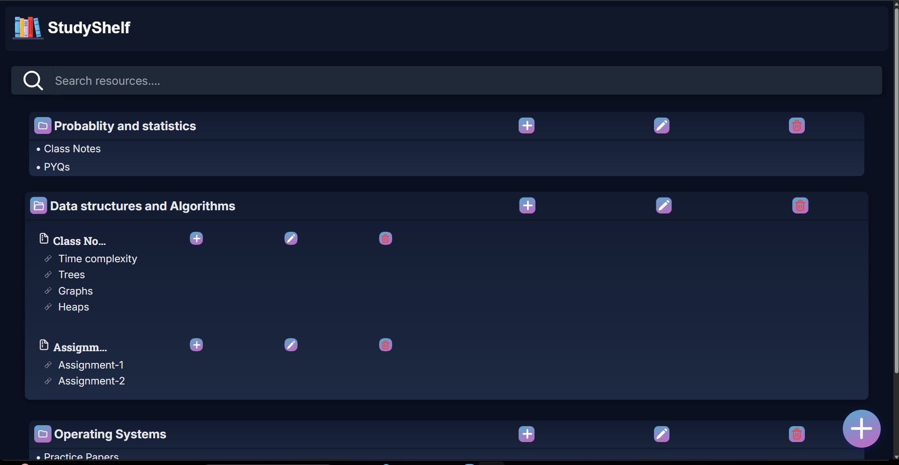

# StudyShelf
StudyShelf is a lightweight client-side web application that helps users to store and manage study resources efficiently. It allows organizing materials under subjects and categories, with support for multiple resources per category.

All data is persisted using browser localStorage, ensuring state is maintained across sessions without a backend.

## 🚀Features
- Structured homepage layout
- Create and manage subjects, dynamically
- Add custom categories (Notes,Assignments,PYQs,etc)
- Store resources with title and (drive links / youtube links)
- Delete subjects, categories and resources
- Dynamic rendering after each operation
- Inline input for fast entry
- Floating action button for adding new resources
- Data persistence using localStorage
- Clean and smooth UI interaction for quick access to study materials

## 🛠️Tech stack
- HTML5
- CSS3
- JavaScript(vanilla)
- Browser localStorage

## Demo📷
- <p align="center">
    
  </p>
- 


## ▶Live Link
https://guptakrish490.github.io/studyshelf/

## What I learned
- Deep DOM manipulation using vanilla JavaScript
- Managing dynamic UI without frameworks
- Structuring scalable logic for nested data
- Handlinng states using local storage
- Debugging real-world UI and  data issues 

## 📂Project structure
```
studyshelf/
  |
  ├---README.md
  |
  ├---index.html
  |
  ├---css/
  |  ├--dashboard.css
  |  ├--form.css
  |  ├--card.css
  |
  ├---js/
  |  ├--form.js
  |  ├--dashboard.js
  |
  ├---assets/
  |  ├--addNewBtn.svg
  |  ├--addNewCategoryBtn.svg
  |  ├--books.svg
  |  ├--categoryFile.svg
  |  ├--closedFolder.svg
  |  ├--link.svg
  |  ├--openFolder.svg
  |  ├--pencilEdit.svg
  |  ├--removeBin.svg
  |  ├--searchButton.svg
  |  ├--studyshelf_mobile.jpeg
  |  ├--studyshelf.png
  |  ├--studyshelf_video.mp4
  ```
  

## ▶️How to Run
1. Clone the repository
2. Open the project folder
3. Open 'index.html' in your browser
---

## 🎯Goal
This project is built to practice:
- Clean UI structuring
- DOM manipulation
- Dynamic UI rendering
- JavaScript fundamentals and logic
- Nested objects and data structures
- Browser localStorage
- Git workflow discipline
---